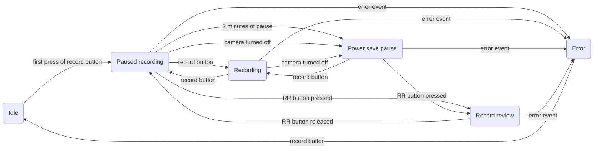

# Beta10Pin

## What is this?

**Beta10Pin** is the hardware adapter that allows connection of Beta camera with 14-pin (K-type) cable to EIAJ 10-pin (J-type) video tape recorder (VTR). Like **Sony CMA-1010** but more functional.

## Supported VTRs

The main target VTR is **Panasonic/National NV-180** which has a small footprint, full direct drive 4-head die-cast transport and non-EIAJ-standard serial link to a camera. But this adapter *should* work with other VTRs that have EIAJ 10-pin connector for a camera. Also, older **Panasonic/National NV-100** VTR and its derivatives have a serial link to the camera but its protocol is unknown and compatibility not tested.

NV-180 compatible machines

**Panasonic NV-180** had several upgraded models...

- **Panasonic AG-2400** (same NV-180 put in "professional" line of products)
- **Panasonic PV-8000** (upgraded model with stereo linear sound and more tape speeds)
- **Panasonic PV-9000** (upgraded yet again with Hi-Fi stereo sound)

...and rebranded variants from other manufacturers:

- **Bauer/Bosch VRP 30** (rebranded NV-180)
- **Blaupunkt RTX-260** (rebranded NV-180)
- **Canon VR-30** (rebranded PV-8000)
- **Canon VR-40** (rebranded PV-9000)
- **Curtis-Mathes KV-773** (rebranded PV-9000)
- **Grundig VS 120** (rebranded NV-180)
- **Magnavox Escort XD (VR8454)** (rebranded PV-8000)
- **Magnavox Escort XHD (VR8455)** (rebranded PV-9000)
- **Olympus VC-104** (rebranded NV-180)
- **Olympus VC-105** (rebranded PV-8000)
- **Olympus VC-106** (rebranded PV-9000)
- **Philips VR6711** (rebranded NV-180)
- **Quasar VP-5741XQ** (rebranded PV-8000)
- **Quasar VP-5748XE** (rebranded PV-9000)
- **Sylvania VC-4512** (rebranded PV-8000)

...and probably more

## Why?

Why not just use CMA-1010?

It's quite hard to find, it's pretty big, it has thick and stiff cable and does not support all features of Sony Beta cameras and features of serial link control for Panasonic NV-180.

Most of all CMA-1010 can not monitor if record process on a VTR has started and just lights up tally light in sync with button press on the camera, which causes false recording indication and loss of footage.

## Features

- Provides power from a VTR to a Beta Camera
- Allows video and audio to be transfered from a camera to a VTR when VTR is in record mode
- Allows video from a VTR to be displayed in a camera's viewfinder when VTR is in playback mode
- Works both with PAL and NTSC VTRs and cameras
- Converts level and pulse pause commands from a camera to level "unpause" signal for a VTR (camera record button mode is auto-detected)
- Allows "Record review" mode (via "RR" button) through backwards picture search
- Monitors VTR's state via serial link and indicates control errors via tally light blinking
- Monitors input voltage and indicates low battery by blinking tally light in a camera
- Monitors camera's power consumption and puts VTR in pause and stand by to preserve energy when camera is turned off
- Allows powering camera without VTR from USB-C PD/QC source (12V input)
- Outputs video and audio through 2xRCA if not connected to a VTR through 10-pin EIAJ connector

## Firmware

Adapter utilizes **Atmel AVR** MCU for logic, serial link and voltage measurement. Firmware project is done in **AtmelStudio**.

Target MCU is **ATmega 48** (either variant). But firmware should be compilable and working on **ATmega 88/168/328** variants as well.

MCU can be clocked from internal 8 MHz RC-oscillator but **external 8 MHz Xtal** is recommended for precise timing.

Due to dependance on ADC measurements and proper serial connection with VTR MCU should run on voltages from **4.5 V** to **5.0 V**.

AVR fuse information

Fuses for **ATmega48P** with *8 MHz Xtal*:
- **SUT0** = 0
- **CKSEL3** = 0
- **SPIEN** = 0
- **EESAVE** = 0
- all other at "1"

In hex form:
- low byte: **0xE7**
- high byte: **0xD7**
- extended byte: **0xFF**

For **ATmega328P** with *internal RC generator*:
- **SUT1** = 0
- **SUT0** = 0
- **CKSEL3** = 0
- **CKSEL2** = 0
- **CKSEL0** = 0
- **SPIEN** = 0
- **EESAVE** = 0
- **BODLEVEL1** = 0
- **BODLEVEL0** = 0
- all other at "1"

In hex form:
- low byte: **0xC2**
- high byte: **0xD7**
- extended byte: **0xFC**

## Hardware

Adapter fits onto single PCB (**BETA10P.M.xx**) of size ~97x30 mm. PCB project is done in **Sprint Layout 6**.

14-pin Beta camera connector, 2xRCA connector and USB-C trigger are soldered onto the PCB. 10-pin EIAJ VTR connector connects via its cable with individual wires soldered into PCB.

The main PCB can be wrapped with shrink tube or slid into plastic/metal case. As an alternative project contains files for 4 more PCBs to assemble case from:
- **BETA10P.F.xx** (29x35 mm) for the front part (holds 14-pin camera connector)
- **BETA10P.B.xx** (29x35 mm) for the back part (2xRCA, USB-C, cable to 10-pin EIAJ connector)
- **BETA10P.S.xx** (98x35 mm) for the both sides
- **BETA10P.C.xx** (98x28 mm) for the top and bottom parts

"*xx*" at the end denotes revision of each PCB.

Provided "case boards" also contain copper fill to shield the insides and connect with main PCB's common. Case is assembled via soldering parts together.

Pinout for ATmega 48/88/168/328 MCU in SMD packages

Power supply:
- **pin 4** *(VCC)*: +5 V supply
- **pin 6** *(VCC)*: +5 V supply
- **pin 18** *(AVCC)*: +5 V supply (ADC and BOD)
- **pin 3** *(GND)*: 0 V (common)
- **pin 5** *(GND)*: 0 V (common)
- **pin 21** *(GND)*: 0 V (common)

Clock input:
- **pin 7** *(PB6)*: 8.0 MHz Xtal
- **pin 8** *(PB7)*: 8.0 MHz Xtal

Voltage monitor:
- **pin 23** *(PC0)*: (input) ADC pin for ***input 12V*** monitoring
- **pin 24** *(PC1)*: (input) ADC pin for output ***camera power*** monitoring

VTR I/O:
- **pin 12** *(PB0)*: (input) video in/out ***direction*** (linked with EIAJ J-type pin 1)
- **pin 9** *(PD5)*: (output) ***pause*** command (linked with EIAJ J-type pin 6)
- **pin 10** *(PD6)*: (output) ***standby*** control (linked with EIAJ J-type pin 5)
- **pin 11** *(PD7)*: (input) serial link ***clock*** (linked with EIAJ J-type pin 4)
- **pin 31** *(PD1)*: (input/output) serial link ***data*** (linked with EIAJ J-type pin 3)

Camera I/O:
- **pin 1** *(PD3)*: (input) record ***pause*** (linked with Beta K-type pin 5)
- **pin 32** *(PD2)*: (input) record ***review*** (linked with Beta K-type pin 8)
- **pin 30** *(PD0)*: (output) ***tally*** light (linked with Beta K-type pin 6)
- **pin 2** *(PD4)*: (output) video ***direction control*** (linked with Beta K-type pin 3)

Relay control:
- **pin 13** *(PB1)*: (output) video ***direction switch*** control

Debug signals:
- **pin 17** *(PB5)*: (output) ***record*** active (solid)/***error*** code (blink, not available for ATmega48)
- **pin 16** *(PB4)*: (output) FW ***heartbeat*** indicator
- **pin 15** *(PB3)*: (output) serial ***transmission indicator***
- **pin 14** *(PB2)*: (output) camera ***power consumption PWM***

## Usage

After connecting adapter to supported VTR and camera and powering on the VTR adapter establishes serial link with the VTR and is held in "**idle**" mode.

When "**Camera**" switch on the front of the VTR is set to "***Normal***" VTR is controlled by its front panel and camera is ignored. User should eject the loading tray, put a recordable VHS cassette inside and close the tray.

Next, "**Camera**" switch on the VTR should be moved into "***Remote***" position to allow the adapter to take control.

First press of the record button on the camera arms the adapter, that commands to set "*record + pause*" mode to the VTR. At the same time tally light on the camera blinks fast and VTR spins up its head drum and loads the tape inside. When VTR gets ready tally light goes out and adapter settles in "**paused recording**" mode, recording does not start yet.

"**Paused recording**" is the main mode of the adapter, ready to begin recording process. User can frame a shot using viewfinder of the camera and arm camera's "*Fader*" function if necessary. When record button is pressed in this state the adapter goes into "**recording**" mode and commands the VTR to clear pause and start recording process. Tally light should light up and stay solid.

If record button is pressed while adapter is in "**recording**" mode, adapter returns back to "**paused recording**" mode, sets "record + pause" for the VTR and turns off tally light.

If camera is switched into "*power save*" mode or gets disconnected, the adapter goes into "**power save pause**" mode. The same happens if "**paused recording**" mode was held for more than 2 minutes. In this mode VTR keeps tape loaded in but stops the drum and deactivates most of the circuits, dropping power consumption five-fold.

When in "**paused recording**" or "**power save pause**" modes "*RR*" button can be pressed and held on the camera (if it's present). That puts adapter into "**record review**" mode when the VTR switches to playback in reverse and displays what was just recorded in camera's viewfinder. As soon as "*RR*" button gets released, adapter returns into "**paused recording**" mode and the VTR is once again put into "*record + pause*" from current place on the tape. While VTR switches from recording to playback and vice versa the tally light on the camera blinks fast.

If any abnormal situation occurs, the adapter senses it and falls back into "**error**" mode which is indicated by slow blinking of the tally light on the camera. VTR should unload the tape and stop. "**Error**" mode can be cleared by single press of the record button on the camera.

Examples of the sources of the error:
- Trying to start recording without a tape in the VTR
- Trying to record on a write-protected tape
- "**Camera**" switch was moved from "***Remote***" position and adapter lost control over the VTR
- VTR or tape malfunction

If battery level gets too low, adapter makes a short blink of the tally light once a second.

## Current state

- Working basic control (VTR controls video path relay, camera controls pause line to VTR)
- Working voltage monitoring and indication in camera
- Working camera connection detection and NV-180 standby function operation
- Working serial link detection and RX/TX
- Working state machine while communicating with NV-180 VTRs through serial link
- Working "record review" processing

## Plans

- Test adapter with other VTRs (without serial link and standby control)

## License
Program copyright 2024.

This program is free software.
Licensed under the Apache License, Version 2.0 (the "License");
