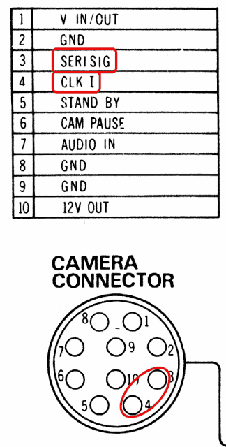
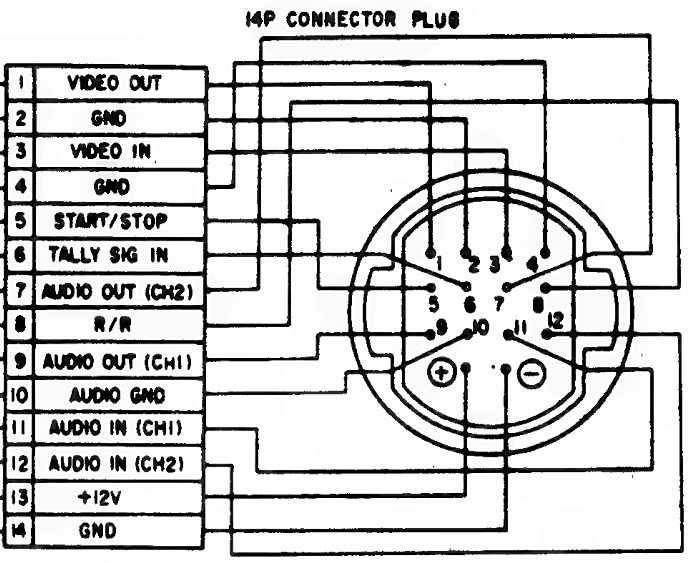
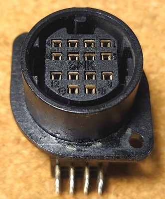
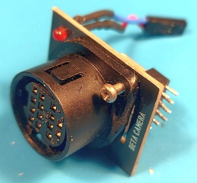
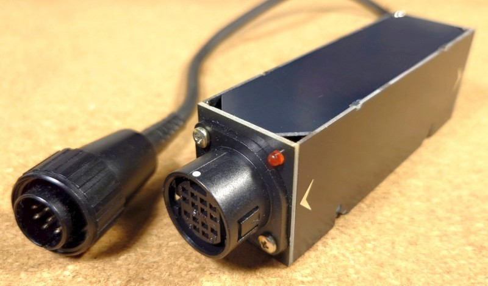
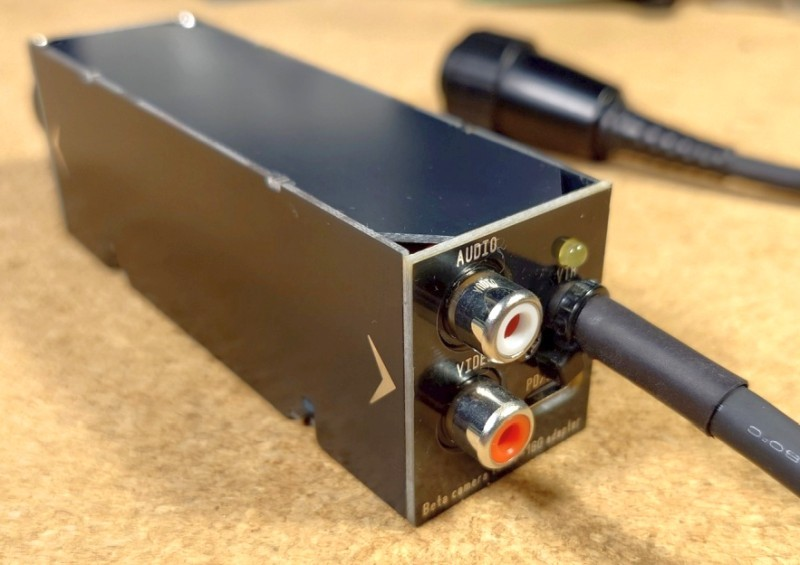
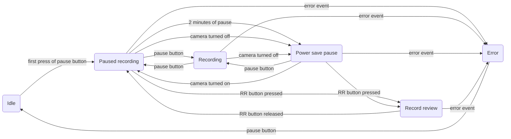
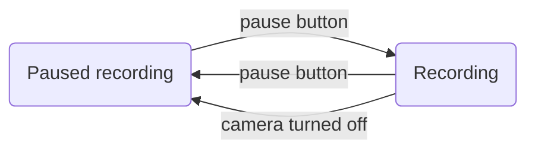

# Beta10Pin

## What is this?

**Beta10Pin** is the hardware adapter that allows connection of Beta camera with 14-pin (K-type) cable to EIAJ 10-pin (J-type) video tape recorder (VTR). Like **Sony CMA-1010** but more functional.

## Supported VTRs

The main target VTR is **Panasonic/National NV-180** which has a small footprint, full direct drive VHS 4-head die-cast transport and non-EIAJ-standard serial link to a camera. But this adapter *should* work with other VTRs that have EIAJ 10-pin connector for a camera. Also, older **Panasonic/National NV-100** VTR and its derivatives have a serial link to the camera but its protocol is unknown and compatibility not tested.

NV-180 compatible machines

**Panasonic NV-180** had several upgraded models...

- **Panasonic AG-2400** (same NV-180 put in "professional" line of products)
- **Panasonic PV-8000** (upgraded model with stereo linear sound and more tape speeds)
- **Panasonic PV-9000** (upgraded yet again with Hi-Fi stereo sound)

...and rebranded variants from other manufacturers:

- **Bauer/Bosch VRP 30** (rebranded NV-180)
- **Blaupunkt RTX-260** (rebranded NV-180)
- **Canon VR-L50** (rebranded NV-180)
- **Canon VR-30** (rebranded PV-8000)
- **Canon VR-40** (rebranded PV-9000)
- **Curtis-Mathes KV-773** (rebranded PV-9000)
- **Grundig VS 120** (rebranded NV-180)
- **Magnavox Escort XD (VR8454)** (rebranded PV-8000)
- **Magnavox Escort XHD (VR8455)** (rebranded PV-9000)
- **Olympus VC-104** (rebranded NV-180)
- **Olympus VC-105** (rebranded PV-8000)
- **Olympus VC-106** (rebranded PV-9000)
- **Philips VR6711** (rebranded NV-180)
- **Quasar VP-5741XQ** (rebranded PV-8000)
- **Quasar VP-5748XE** (rebranded PV-9000)
- **Sylvania VC-4512** (rebranded PV-8000)

...and probably more

## Why?

Why not just use CMA-1010?

It's quite hard to find, it's pretty big, it has thick and stiff cable and does not support all features of Sony Beta cameras and features of serial link control for Panasonic NV-180.

Most of all CMA-1010 can not monitor if record process on a VTR has started and just lights up tally light in sync with button press on the camera, which causes false recording indication and loss of footage. Also low battery indication function is not available. And Rec Review function is unavailable.

## Features

- Provides power from a VTR to a Beta Camera
- Allows video and audio to be transfered from a camera to a VTR when VTR is in record state
- Allows video from a VTR to be displayed in a camera's viewfinder when VTR is in playback state
- Works both with PAL and NTSC VTRs and cameras
- Converts level and pulse pause commands from a camera to level "unpause" signal for a VTR (camera record button mode is auto-detected)
- Allows "Record review" state (via "RR" button) through picture search
- Monitors VTR's state via serial link and indicates control errors via tally light blinking
- Monitors supply voltage and indicates low battery by blinking tally light in a camera
- Monitors camera's power consumption and puts VTR in pause and stand by to preserve energy when camera is turned off
- Allows powering camera without VTR from USB-C PD/QC source (12V input)
- Outputs video and audio through 2xRCA if not connected to a VTR through 10-pin EIAJ connector

## Firmware

Adapter utilizes **Atmel AVR** MCU for logic, serial link and voltage measurement. Firmware project is done in **AtmelStudio 7**.

Target MCU is **ATmega 88** (either variant). But firmware should be compilable and working on **ATmega 168/328** variants as well. **ATmega 48** is not supported due to low ROM capacity.

MCU can be clocked from internal 8 MHz RC-oscillator but **external 8 MHz Xtal** is recommended for precise timing.

Due to dependance on ADC measurements and proper serial connection with VTR MCU should run on voltages from **4.5 V** to **5.0 V**. Thus BOD (Brown-out Detector) is enabled by MCU fuses.

AVR fuses for ATmega88/ATmega168 with 8 MHz Xtal

- **SUT1** = 0
- **CKSEL3** = 0
- **SPIEN** = 0
- **BODLEVEL1** = 0
- **BODLEVEL0** = 0
- all other at "1"

In hex form:
- low byte: **0xD7**
- high byte: **0xDC**
- extended byte: **0xFF**

AVR fuses for ATmega328 with 8 MHz Xtal

- **SUT1** = 0
- **CKSEL3** = 0
- **SPIEN** = 0
- **BODLEVEL1** = 0
- **BODLEVEL0** = 0
- all other at "1"

In hex form:
- low byte: **0xD7**
- high byte: **0xDF**
- extended byte: **0xFC**

AVR fuses for ATmega328 with internal RC generator

- **SUT1** = 0
- **SUT0** = 0
- **CKSEL3** = 0
- **CKSEL2** = 0
- **CKSEL0** = 0
- **SPIEN** = 0
- **BODLEVEL1** = 0
- **BODLEVEL0** = 0
- all other at "1"

In hex form:
- low byte: **0xC2**
- high byte: **0xDF**
- extended byte: **0xFC**

## Hardware

Adapter fits onto single PCB (**BETA10P.M.xx**) of size ~97x30 mm (1.6 mm thick). PCB project is done in **Sprint Layout 6**.

The main PCB can be wrapped with shrink tube or slid into plastic/metal case. As an alternative project contains files for 4 more PCBs to assemble case from:
- **BETA10P.F.xx** (30x35 mm, 1.6 mm thick) for the front part (holds 14-pin camera connector)
- **BETA10P.B.xx** (30x35 mm, 1.6 mm thick) for the back part (2xRCA, USB-C, cable to 10-pin EIAJ connector)
- **BETA10P.S.xx** (98x35 mm, 1.0 mm thick) for the both sides (2 pcs per adapter)
- **BETA10P.C.xx** (98x30 mm, 1.0 mm thick) for the top and bottom parts (2 pcs per adapter)

"*xx*" at the end denotes revision of each PCB. Release can contain boards of different revisions ("xx" doesn't have to be the same).

Provided "case boards" also contain copper fill to shield the insides and connect with main PCB's common.

Pinout for ATmega 88/168/328 MCU in SMD packages

Power supply:
- **pin 4** *(VCC)*: +5 V supply
- **pin 6** *(VCC)*: +5 V supply
- **pin 18** *(AVCC)*: +5 V supply (ADC and BOD)
- **pin 3** *(GND)*: 0 V (common)
- **pin 5** *(GND)*: 0 V (common)
- **pin 21** *(GND)*: 0 V (common)

Clock input:
- **pin 7** *(PB6)*: 8.0 MHz Xtal
- **pin 8** *(PB7)*: 8.0 MHz Xtal

Voltage monitor:
- **pin 23** *(PC0)*: (input) ADC pin for ***input 12V*** monitoring
- **pin 24** *(PC1)*: (input) ADC pin for output ***camera power*** monitoring

VTR I/O:
- **pin 12** *(PB0)*: (input) video in/out ***direction*** (linked with EIAJ J-type pin 1)
- **pin 9** *(PD5)*: (output) ***pause*** command (linked with EIAJ J-type pin 6, *active high*)
- **pin 10** *(PD6)*: (output) ***standby*** control (linked with EIAJ J-type pin 5, *active high*)
- **pin 11** *(PD7)*: (input) serial link ***clock*** (linked with EIAJ J-type pin 4)
- **pin 31** *(PD1)*: (input/output) serial link ***data*** (linked with EIAJ J-type pin 3)

Camera I/O:
- **pin 1** *(PD3)*: (input) record ***pause*** (linked with Beta K-type pin 5)
- **pin 32** *(PD2)*: (input) record ***review*** (linked with Beta K-type pin 8)
- **pin 30** *(PD0)*: (output) ***tally*** light (linked with Beta K-type pin 6, *active high*)
- **pin 2** *(PD4)*: (output) video ***direction control*** (linked with Beta K-type pin 3)

Relay control:
- **pin 13** *(PB1)*: (output) video ***direction switch*** control

Debug signals:
- **pin 17** *(PB5)*: (output) ***record*** active (solid)/***error*** code (blinking)
- **pin 16** *(PB4)*: (output) FW ***heartbeat*** indicator
- **pin 14** *(PB2)*: (output) ***camera presence***

 

## Assembly

14-pin Beta connector should be put through the front PCB before soldering to the main PCB. Front PCB should be screwed to the 14-pin Beta connector through soldered M2.5 nuts.

 

 

VTR cable (with a 10-pin connector) should be routed through the back PCB before connecting to the main PCB. Back PCB should be screwed to the RCA connector block.

14-pin Beta camera connector, 2xRCA connector and USB-C PD/QC trigger are soldered onto the main PCB. VTR cable's individual wires are connected to the main PCB through connectors.

Case cover is assembled by soldering top and side parts together at the 90 degree angles. After that assembled cover should be slid onto the main PCB from the top and soldered in all corners to the front and back PCBs. When front and back PCBs are secured, main PCB should be soldered to the side PCB on a single joint on the bottom.

Bottom PCB has to be put last and soldered on its perimeter to the case PCBs.

Main PCB provides AVR ISP header for uploading and updating firmware. In normal use the same connector is used to connect "*Heartbeat*" and "*Record/Error*" LEDs on the case.

## Usage

### General operation

Adapter can operate in one of two modes: "*serial link mode*" and "*direct mode*". The mode is determined by what and when adapter is connected to. "Serial link mode" requires **Beta10Pin** to be connected to **NV-180** (or compatible, see list above) VTR with serial bus for monitoring and enhanced control. Adapter should be connected before VTR is turned on, otherwise VTR will disable serial link till next power up and the adapter will be operating in "direct mode".

Each operating mode is explained in details below.

**Beta10Pin** adapter has three camera-related controls:
- record pause button
- Rec Review (RR) button
- camera's power consumption

Main control input is the record pause button on the camera. It pauses/unpauses recording, arms the controller and the VTR (in "serial link mode"), clears an error state (in "serial link mode"). Camera also can have "Rec Review" ("RR") button that operates only in "serial link mode". The third input is camera's power consumption from which **Beta10Pin** adapter determines if camera is connected/powered on and if power saving should be activated.

**Beta10Pin** adapter has three visual indicators:
- tally light on the camera
- "record/error" LED on the adapter's case
- "heartbeat" LED on the adapter's case

Tally light can indicate:
- active unpaused recording (solid light)
- low voltage (low battery) condition (short blink once a second)
- state switching, waiting for the VTR (fast continuous blinking, 5 Hz, only in "serial link mode")
- error state (slow continuous blinking, 2 Hz, only in "serial link mode")

"Record/Error" LED can indicate:
- active unpaused recording (solid light)
- error state (loop of short blinks according to the error code, only in "serial link mode")

"Heartbeat" LED can indicate:
- firmware is alive, operating in "serial link mode" (fast continuous blinking, 5 Hz)
- firmware is alive, operating in "direct mode" (slow continuous blinking, 1 Hz)

Controls and indicators are explained in more details below.

### Camera record trigger

Cameras can have different "trigger modes" for the pause button that usually can be selected with a switch at the bottom of the camera.

Usual pause button modes:
- default at "low", toggling state with each button press
- default at "high", toggling state with each button press
- default at "high", producing ~200 ms negative pulse with each button press

**CMA-1010** adapter only supports two trigger modes and for selecting between those you have to open up its case and move a physical switch inside. **Beta10Pin** auto-detects trigger mode of the camera and responds on every button press on the camera correctly.

### Serial link mode

After connecting adapter to supported VTR (NV-180 or other from "Supported VTRs" list), to Beta camera and powering on the VTR adapter establishes serial link with the VTR and is held in "**idle**" state.

When "**Camera**" switch on the front of the VTR is set to "***Normal***" position VTR is controlled by its front panel and camera adapter has no effect and is ignored. User should eject the loading tray, put a recordable VHS cassette inside and close the tray.

Next, "**Camera**" switch on the VTR should be moved into "***Remote***" position to allow the **Beta10Pin** adapter to take control.

First press of the pause button on the camera arms the adapter, that commands to set "*record + pause*" mode to the VTR. At the same time tally light on the camera blinks fast and VTR spins up its head drum and loads the tape inside. When VTR gets ready tally light goes out and adapter settles in "**paused recording**" state, recording does not start yet.

"**Paused recording**" is the main state of the adapter, ready to begin recording process. User is free to frame a shot using viewfinder and arm camera's special effects if necessary. When pause button is pressed in this state the adapter goes into "**recording**" state and commands the VTR to clear pause and start recording process. Tally light should light up and stay solid.

If pause button is pressed while adapter is in "**recording**" state, adapter returns back to "**paused recording**" state, sets "record + pause" for the VTR and turns off camera's tally light.

If camera is switched into "*power save*" or gets disconnected, the adapter goes into "**power save pause**" state. The same happens if "**paused recording**" state was held for more than 2 minutes. In "**power save pause**" state NV-180 keeps tape loaded in but stops the drum and deactivates most of the circuits, dropping power consumption five-fold.

While in "**paused recording**" or "**power save pause**" states "*Rec Review (RR)*" button can be pressed and held on the camera (if it's present). That puts adapter into "**record review**" state when the VTR switches to playback in reverse and displays what was just recorded in camera's viewfinder. If pause button is pressed while "*Rec Review (RR)*" button is held, playback direction is reversed. As soon as "*Rec Review (RR)*" button gets released adapter goes into short "**pause**" and then returns into "**paused recording**" state putting the VTR once again into "*record + pause*" from current place on the tape. While VTR switches from recording to playback and vice versa the tally light on the camera blinks fast.

If any abnormal situation occurs, the adapter senses that and falls into "**error**" state which is indicated by slow blinking of the tally light on the camera. VTR should unload the tape and stop. "**Error**" state can be cleared by single press of the pause button on the camera. After error is cleared adapter returns to the start-up "**idle**" state.

Examples of the sources of the error:
- Trying to start recording without a tape in the VTR (*error code 1*)
- Trying to record on a write-protected tape (*error code 2*)
- VTR or tape malfunction (*error code 3*)
- "**Camera**" switch was moved from "***Remote***" position and adapter lost control over the VTR (*error code 4*)

In "**error**" state "Record/Error" LED on the adapter's case will blink in cycle the same number of times as error code number is.

If battery level gets too low, adapter makes a short blink of the tally light once a second.

### Direct mode

If the VTR does not have a serial link (or the link has failed for any reason) adapter senses that and falls back into "direct" control mode. In this mode **Beta10Pin** adapter operates more or less like **Sony CMA-1010**.

The only control mechanism in this mode is "pause" wire in the 10-pin EIAJ connector (pin 6) with no feedback from a VTR to a camera. No monitoring of the VTR state and no direct control of VTR state is available in this mode.

With every press of pause button on the camera adapter will toggle "pause" signal to the VTR and tally light on the camera. If VTR was in "**paused recording**" state it will go into "**recording**" state, if VTR was in "**recording**" state it will go into "**paused recording**" state.

If there was no tape in the VTR or recording state was not armed by the user probably nothing will happen on the VTR side (while tally light on the camera will still light up) leading to loss of video material.

If adapter senses that VTR switched into playback state, firmware will toggle "**recording**" state to "**paused recording**" and turn off tally light on the camera.

"*Rec Review (RR)*" button on the camera will have no effect on the VTR, no "**record review**" functionality is available in this mode.

If camera is switched into "*power save*" or gets disconnected, the adapter goes into "**paused recording**" state and turns off tally light on the camera.

If battery level gets too low, adapter makes a short blink of the tally light once a second.

## Current state

These things work:
- basic control (VTR controls video path relay, camera controls pause line to VTR)
- voltage monitoring and indication in camera
- camera connection detection and NV-180 standby function operation
- serial link detection and RX/TX
- state machine while communicating with NV-180 VTRs through serial link
- "record review" processing

## Plans

- test adapter with other VTRs (without serial link and standby control)

## License
Program copyright 2024-2025.

This program is free software.
Licensed under the Apache License, Version 2.0 (the "License");
