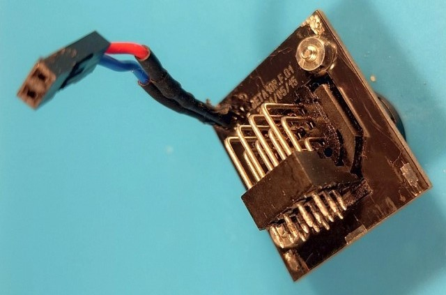
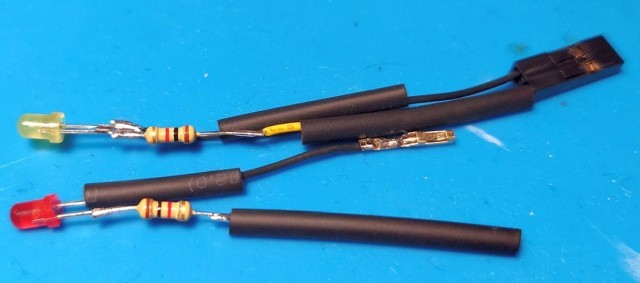

# Beta10Pin

## Что это?

**Beta10Pin** - это аппаратный адаптер, который позволяет подключать камеры Beta с 14-контактным (K-type) кабелем к 10-контактному разъёму EIAJ (J-type) на видеомагнитофонах (VTR). Примерно как **Sony CMA-1010**, но с лучшим функционалом.

## Поддерживаемые видеомагнитофоны

Основной целевой магнитофон - это **Panasonic/National NV-180**, который имеет небольшие габариты, металлический литой лентопротяжный VHS механизм с полным прямым приводом, 4-мя видео-головками и имеет проприетарную последовательную шину обмена данными с камерой. Но этот адаптер также *должен* работать с другими видеомагнитофонами, имеющими аналогичный 10-контактный EIAJ разъём для подключения камеры. Существует ещё более старый аппарат **Panasonic/National NV-100** с его перемаркированными вариантами, у которого тоже есть последовательная шина для камеры, но её протокол неизвестен и совместимость не проверялась.

Аналогичные NV-180 магнитофоны

На базе **Panasonic NV-180** выпускались доработанные модели...

- **Panasonic AG-2400** (тот же NV-180, но для "профессиональной" линейки аппаратов)
- **Panasonic PV-8000** (усовершенствованная модель с линейным стерео звуком и большим набором скоростей ленты)
- **Panasonic PV-9000** (снова доработанная модель с Hi-Fi стерео звуком)

...а также перемаркированные варианты под другими брендами:

- **Bauer/Bosch VRP 30** (перемаркированный NV-180)
- **Blaupunkt RTX-260** (перемаркированный NV-180)
- **Canon VR-L50** (перемаркированный NV-180)
- **Canon VR-30** (перемаркированный PV-8000)
- **Canon VR-40** (перемаркированный PV-9000)
- **Curtis-Mathes KV-773** (перемаркированный PV-9000)
- **Grundig VS 120** (перемаркированный NV-180)
- **Magnavox Escort XD (VR8454)** (перемаркированный PV-8000)
- **Magnavox Escort XHD (VR8455)** (перемаркированный PV-9000)
- **Olympus VC-104** (перемаркированный NV-180)
- **Olympus VC-105** (перемаркированный PV-8000)
- **Olympus VC-106** (перемаркированный PV-9000)
- **Philips VR6711** (перемаркированный NV-180)
- **Quasar VP-5741XQ** (перемаркированный PV-8000)
- **Quasar VP-5748XE** (перемаркированный PV-9000)
- **Sylvania VC-4512** (перемаркированный PV-8000)

...и, вероятно, другие

## Зачем?

Почему бы просто не использовать CMA-1010?

Его трудно найти, он довольно больших размеров, имеет толстый жёсткий кабель и не поддерживает всех возможностей как камер Sony, так и управления Panasonic NV-180 по последовательной шине.

Самое главное, что CMA-1010 не отслеживает, началась ли запись на видеомагнитофоне и просто зажигает лампочку "запись" синхронно с нажатием кнопки управления записью на камере, что может привести к некорректной индикации и потери снимаемого материала. Не поддерживается и индикация севшей батареи. Как и недоступна функция Rec Review (просмотра уже отснятого).

## Возможности

- Передаёт питание от видеомагнитофона на Beta камеру
- Позволяет передавать видео и аудио с камеры на видеомагнитофон, когда магнитофон в режиме записи
- Позволяет отобразить видео с видеомагнитофона в видоискателе камеры, когда магнитофон в режиме воспроизведения
- Работает как с PAL, так и с NTSC видеомагнитофонами и камерами
- Преобразует управление паузой по уровню или импульсом с камеры в управление паузой по уровню для видеомагнитофона (режим кнопки паузы на камере определяется автоматически)
- Позволяет просматривать последние отснятые материалы, используя кнопку RR ("Record review") на камере
- Отслеживает состояние видеомагнитофона через последовательную шину и индицирует ошибки управления через мигание индикатора записи
- Отслеживает питающие напряжение и индицирует малый уровень заряда через мигание индикатора записи на камере
- Наблюдает за потреблением камеры и переводит видеомагнитофон в режим паузы и энергосбережения, когда камера отключается
- Позволяет запитывать камеру от USB-C источника с поддержкой PD/QC без участия видеомагнитофона (12 В вход)
- Выводит видео и аудио с камеры через 2xRCA без подключения к видеомагнитофону через 10-контактный разъём

## Прошивка

Адаптер использует микроконтроллер **Atmel AVR** для логики обработки режимов, связи по последовательной шине и замера напряжения. Проект прошивки создан в **AtmelStudio 7**.

Целевой МК - это **ATmega 88** (любой из вариантов). Но прошивка должна собираться и работать на вариантах **ATmega 168/328**. МК **ATmega 48** не поддерживается из-за слишком малого объёма ПЗУ.

МК может тактироваться от внутреннего 8 МГц RC-генератора, но **внешний кварцевый резонатор на 8 МГц** рекомендуется для точных таймингов.

Из-за необходимости замерять напряжения с помощью АЦП и поддержания корректного обмена с видеомагнитофоном микроконтроллер должен работать при напряжениях от **4,5 В** до **5,0 В**. Для этого включён BOD (Brown-out Detector) через фьюзы МК.

Фьюзы для ATmega88/ATmega168 с 8 МГц кварцевым резонатором

- **SUT1** = 0
- **CKSEL3** = 0
- **SPIEN** = 0
- **BODLEVEL1** = 0
- **BODLEVEL0** = 0
- все остальные "1"

В hex-виде:
- low byte: **0xD7**
- high byte: **0xDC**
- extended byte: **0xFF**

Фьюзы для ATmega328 с 8 МГц кварцевым резонатором

- **SUT1** = 0
- **CKSEL3** = 0
- **SPIEN** = 0
- **BODLEVEL1** = 0
- **BODLEVEL0** = 0
- все остальные "1"

В hex-виде:
- low byte: **0xD7**
- high byte: **0xDF**
- extended byte: **0xFC**

Фьюзы для ATmega328 с внутренним RC-генератором

- **SUT1** = 0
- **SUT0** = 0
- **CKSEL3** = 0
- **CKSEL2** = 0
- **CKSEL0** = 0
- **SPIEN** = 0
- **BODLEVEL1** = 0
- **BODLEVEL0** = 0
- все остальные "1"

В hex-виде:
- low byte: **0xC2**
- high byte: **0xDF**
- extended byte: **0xFC**

## Аппаратная часть

Адаптер умещается на одной печатной плате (**BETA10P.M.xx**) размером ~97x30 мм (толщиной 1,6 мм). Проект печатной платы создан в **Sprint Layout 6**.

Основная печатная плата может быть упакована в термоусадочную трубку или вставлена в пластиковый/металлический корпус. В качестве альтернативы проект содержит 4 дополнительных платы для сборки корпуса:
- **BETA10P.F.xx** (30x35 мм, толщина 1,6 мм) для передней части (крепит 14-контактный разъём камеры)
- **BETA10P.B.xx** (30x35 мм, толщина 1,6 мм) для задней части (2xRCA, USB-C, кабель к 10-контактному разъёму EIAJ)
- **BETA10P.S.xx** (98x35 мм, толщина 1,0 мм) для боковых частей (2 шт. на адаптер)
- **BETA10P.C.xx** (98x30 мм, толщина 1,0 мм) for the top and bottom parts (2 шт. на адаптер)

"*xx*" на конце обозначает версию печатной платы. Релиз может содержать платы разных версий ("xx" не обязательно должны быть одинаковыми).

Предоставленные "корпусные платы" содержат заливку медью для экранирования содержимого и соединяются с общим основной печатной платы.

Цоколёвка ATmega 88/168/328 в SMD корпусе

Питание:
- **вывод 4** *(VCC)*: +5 В питание
- **вывод 6** *(VCC)*: +5 В питание
- **вывод 18** *(AVCC)*: +5 В питание (АЦП и BOD)
- **вывод 3** *(GND)*: 0 В (общий)
- **вывод 5** *(GND)*: 0 В (общий)
- **вывод 21** *(GND)*: 0 В (общий)

Тактирование:
- **вывод 7** *(PB6)*: 8.0 МГц кварц
- **вывод 8** *(PB7)*: 8.0 МГц кварц

Мониторинг напряжения:
- **вывод 23** *(PC0)*: (вход) контакт АЦП для контроля ***входного напряжения 12 В***
- **вывод 24** *(PC1)*: (вход) контакт АЦП для контроля выходного ***питания камеры***

Интерфейс видеомагнитофона:
- **вывод 12** *(PB0)*: (вход) направление видео ***direction*** (соединяется с контактом 1 разъёма EIAJ)
- **вывод 9** *(PD5)*: (выход) управление ***паузой*** (соединяется с контактом 6 разъёма EIAJ, *активный высокий*)
- **вывод 10** *(PD6)*: (выход) управление ***энергосбережением*** (соединяется с контактом 5 разъёма EIAJ, *активный высокий*)
- **вывод 11** *(PD7)*: (вход) ***тактирование*** последовательной шины (соединяется с контактом 4 разъёма EIAJ)
- **вывод 31** *(PD1)*: (вход/выход) ***данные*** последовательной шины (соединяется с контактом 3 разъёма EIAJ)

Интерфейс камеры:
- **вывод 1** *(PD3)*: (вход) ***пауза*** записи (соединяется с контактом 5 разъёма Beta)
- **вывод 32** *(PD2)*: (вход) ***отсмотр*** записанного (соединяется с контактом 8 разъёма Beta)
- **вывод 30** *(PD0)*: (выход) ***индикатор записи*** (соединяется с контактом 6 разъёма Beta, *активный высокий*)
- **вывод 2** *(PD4)*: (выход) ***управление направлением*** видео (соединяется с контактом 3 разъёма Beta)

Управление реле:
- **вывод 13** *(PB1)*: (выход) ***управление направлением*** видео

Отладочные сигналы:
- **вывод 17** *(PB5)*: (выход) ***запись*** активна (постоянно светится)/код ***ошибки*** (мигает)
- **вывод 16** *(PB4)*: (выход) индикатор работоспособности прошивки (индикатор ***пульса***)
- **вывод 14** *(PB2)*: (выход) ***обнаружение камеры***

 

## Сборка

14-контактный разъём Beta должен быть продет через отверстие в передней печатной плате перед запаиванием в основную плату. Передняя плата прикручивается к Beta разъёму через гайки М2,5, припаянные к передней плате.

 

 

Кабель видеомагнитофона (с 10-контактным разъёмом) должен быть продет через заднюю печатную плату перед соединением с основной платой. Задняя плата прикручивается к блоку разъёмов RCA.

14-контактный Beta разъём, разъёмы RCA и USB-C PD/QC триггер запаиваются на основную плату. Провода кабеля видеомагнитофона соединяются с основной платой через разъёмы.

Крышка корпуса собирается спаиванием верхней и боковых частей вместе под прямым углом друг к другу. После этого собранная крышка опускается на основную плату сверху и припаивается по углам к передней и задней платам. После фиксирования передней и задней плат основная плата припаивается снизу к боковой плате на единственную точку пайки.

В последнюю очередь устанавливается нижняя плата и запаивается по периметру к корпусным платам.

На основной плате расположен разъём внутрисхемного программирования AVR ISP для заливки и обновления прошивки. В нормальной работе тот же разъём используется для подключения индикаторов "*Пульс*" и "*Запись*" на корпусе.

## Использование

### Общая работа

Адаптер может работать в одном из двух режимов: "*режим цифровой шины*" и "*прямой режим*". Режим задаётся тем, к чему и когда адаптер был подключён. "Режим цифровой шины" требует подключения **Beta10Pin** к рекордеру **NV-180** (или совместимому, см. список выше) через последовательную шину для мониторинга и расширенного управления. Адаптер должен быть подключён к видеомагнитофону до его включения, иначе магнитофон отключает последовательную шину до следующей подачи питания и адаптер будет работать в "прямом режиме".

Каждый из режимов подробно описан ниже.

Адаптер **Beta10Pin** имеет три управляющих сигнала, относящихся к камере:
- кнопка паузы записи
- кнопка Rec Review (RR)
- потребление камеры

Основной управляющий сигнал - кнопка паузы записи. Она ставит в/снимает с паузы запись, подготавливает адаптер и видеомагнитофон (в "режиме цифровой шины"), сбрасывает состояние ошибки (в "режиме цифровой шины"). На камере может находиться кнопка "Rec Review" ("RR"), которая работает только в "режиме цифровой шины". Третий сигнал - это потребление камеры, по которому адаптер **Beta10Pin** определяет, подключена ли камера/включена ли она и нужно ли активировать режим энергосбережения.

Адаптер **Beta10Pin** имеет три визуальных индикатора:
- индикатор записи на камере
- светодиод "запись/ошибка" на корпусе адаптера
- светодиод "пульс" на корпусе адаптера

Индикатор записи на камере может показывать:
- активный процесс записи (постоянное свечение)
- низкий заряд батареи (короткое моргание раз в секунду)
- переключение состояния, ожидание видеомагнитофона (быстрое мигание, 5 Гц, только в "режиме цифровой шины")
- состояние ошибки (постоянное медленное мигание, 2 Гц, только в "режиме цифровой шины")

Светодиод "запись/ошибка" может показывать:
- активный процесс записи (постоянное свечение)
- состояние ошибки (цикл из коротких вспышек, соответствующих коду ошибки, только в "режиме цифровой шины")

Светодиод "пульс" может показывать:
- прошивка "жива", работа в "режиме цифровой шины" (быстрое мигание, 5 Гц)
- прошивка "жива", работа в "прямом режиме" (медленное мигание, 1 Гц)

Органы управления и индикация подробнее описаны ниже.

### Кнопка паузы записи

Камеры могут иметь разные режимы работы кнопки паузы, которые обычно выбираются переключателем снизу камеры.

Обычные варианты режимов кнопки паузы:
- по умолчанию "низкий" уровень, переключение состояния по каждому нажатию кнопки
- по умолчанию "высокий" уровень, переключение состояния по каждому нажатию кнопки
- по умолчанию "высокий" уровень, ~200 мс негативный импульс по каждому нажатию кнопки

Адаптер **CMA-1010** поддерживает только два режима кнопки паузы и для выбора между ними необходимо вскрыть корпус и поменять положения переключателя внутри. **Beta10Pin** автоматически определяет режим кнопки на камере и корректно реагирует на каждое нажатие.

### Режим цифровой шины

После подключения адаптера к поддерживаемому видеомагнитофону (NV-180 или другой из списка "Поддерживаемые видеомагнитофоны"), к Beta камере и включения магнитофона адаптер устанавливает обмен с магнитофоном по последовательной шине, находясь в состоянии "**простоя**".

Когда переключатель "**Camera**" на передней панели видеомагнитофона находится в положении "***Normal***", магнитофон управляется органами управления на передней панели, камерный адаптер игнорируется. В этом состоянии пользователь должен открыть лоток, загрузить VHS кассету под запись и закрыть лоток.

Далее, переключатель "**Camera**" должен быть перемещён в положение "***Remote***", чтобы позволить адаптеру **Beta10Pin** взять управление на себя.

Первое нажатие на кнопку паузы на камере подготавливает адаптер к работе, который, в свою очередь, коммандует видеомагнитофону перейти в режим "*запись + пауза*". Одновременно с этим индикатор записи на камере быстро мигает, а видеомагнитофон разгоняет БВГ и заправляет ленту в ЛПМ. Когда магнитофон заканчивает подготовку, адаптер гасит индикатор записи на камере и переходит в состояние "**пауза записи**", запись в этот момент ещё не начинается.

"**Пауза записи**" - это основное состояние адаптера, готовность начать запись. Пользователь свободен кадрировать, используя видоискатель, и подготавливать спецэффекты камеры к съёмке. При нажатии кнопки паузы в этом состоянии адаптер переходит в состояние "**запись**" и командует видеомагнитофону снять паузу и начать процесс записи. Индикатор записи при этом должен начать постоянно светиться.

При нажатии кнопки паузы в состоянии "**записи**" адаптер возвращается в состояние "**пауза записи**", командует видеомагнитофону установить режим "*запись + пауза*" и выключает индикатор записи на камере.

Если камера переключается в *режим энергосбережения* или отключается от адаптера, адаптер переходит в состояние "**пауза с энергосбережением**". То же самое происходит, если адаптер находится в состоянии "**пауза записи**" более 2-х минут. В состоянии "**пауза с энергосбережением**" NV-180 не убирает ленту в кассету, но останавливает БВГ и отключает большую часть своих схем, снижая потребление примерно в 5 раз.

При нажатии и удержании кнопки "*Rec Review (RR)*" на камере в состояниях "**пауза записи**" или "**пауза с энергосбережением**" адаптер переходит в состояние "**отсмотр записанного**". В этом состоянии видеомагнитофон переключается в "*режим воспроизведения*" в обратном направлении и отображает только что записанные материалы через видоискатель камеры. Если во время удержания кнопки "*Rec Review (RR)*" нажать кнопку паузы, направление воспроизведения инвертируется. При отпускании кнопки "*Rec Review (RR)*" адаптер кратковременно переходит в состояние "**паузы**", а затем возвращается в состояние "**пауза записи**", переводя видеомагнитофон снова в режим "*запись + пауза*" из текущего положения на ленте. В то время, пока видеомагнитофон переключается из режима записи в воспроизведение и обратно, индикатор записи на камере быстро моргает.

При возникновении любой нештатной ситуации адаптер переходит в состояние "**ошибки**", которое индицируется медленным миганием индикатора записи. Видеомагнитофон должен смотать ленту в кассету и остановиться. Состояние "**ошибки**" можно сбросить однократным нажатием кнопки паузы на камере. После сброса ошибки адаптер возвращается к стартовому состоянию "**простоя**".

Примеры возможных источников ошибки:
- Попытка начать запись без вставленной в видеомагнитофон кассеты (*код ошибки 1*)
- Попытка начать запись на кассету, защищённую от записи (*код ошибки 2*)
- Отказ видеомагнитофона или проблема с кассетой (*код ошибки 3*)
- Переключатель "**Camera**" был перемещён из положения "***Remote***" и адаптер потерял контроль над магнитофоном (*код ошибки 4*)

В состоянии "**ошибки**" светодиод "запись/ошибка" на корпусе адаптера в цикле повторяет вспышки, число которых соответствует коду ошибки.

Если уровень заряда батареи становится слишком низким, адаптер начинает коротко мигать индикатором записи раз в секунду.

### Прямой режим

Если видеомагнитофон не поддерживает последовательную цифровую шину (или соединение было разорвано по какой-либо причине), адаптер переходит к запасному режиму работы - "прямому режиму". В этом режиме адаптер **Beta10Pin** работает примерно как **Sony CMA-1010**.

Единственный метод управления в этом режиме - это сигнал "пауза" на 6-м контакте 10-контактного разъёма EIAJ без какой либо обратной связи от видеомагнитофона. В этом режиме недоступен мониторинг состояния магнитофона и невозможно прямое управление режимами магнитофона.

С каждым нажатием кнопки паузы на камере адаптер будет переключать состояние сигнала "пауза" для видеомагнитофона и индикатора записи на камере. Если видеомагнитофон находился в состоянии "**паузы записи**", то он перейдёт в состояние "**записи**", если магнитофон был в состоянии "**записи**", то он перейдёт в состояние "**пауза записи**".

Если в видеомагнитофон не была установлена лента или сам процесс записи не был предварительно запущен пользователем, то со стороны видеомагнитофона не произойдёт ничего (не смотря на включение индикатора записи на камере), что приведёт к потере снимаемого материала.

Если адаптер обнаружит, что видеомагнитофон переключился в режим воспроизведения, то прошивка переключит состояние "**записи**" в "**паузу записи**" и выключит индикатор записи на камере.

Кнопка "*Rec Review (RR)*" на камере не будет делать ничего, функционала "**отсмотр записанного**" в этом режиме нет.

Если камера переключится в *режим энергосбережения* или отключится от адаптера, последний перейдёт в состояние "**паузы записи**" и выключит индикатор записи на камере.

Если уровень заряда батареи становится слишком низким, адаптер начинает коротко мигать индикатором записи раз в секунду.

## Текущее состояние

Работает следующее:
- базовое управление (видеомагнитофон управляет реле направления видеосигнала, камера управляет состоянием линии "пауза" для магнитофона)
- контроль напряжения и индикация на камере
- определение наличия потребления камеры и работа функции энергосбережения в NV-180
- определение наличия соединения по цифровой шине и приёмопередача данных
- машина состояний, поддерживающая обмен с магнитофоном NV-180 по цифровой шине
- функционал "**отсмотра записанного**"

## Планы

- проверить адаптер на работу с другими видеомагнитофонами (без цифровой шины и управления энергосбережением)

## Лицензия
Копирайт 2024-2025.

This program is free software.
Этот проект лицензирован под Apache License, версии 2.0 ("Лицензия");
